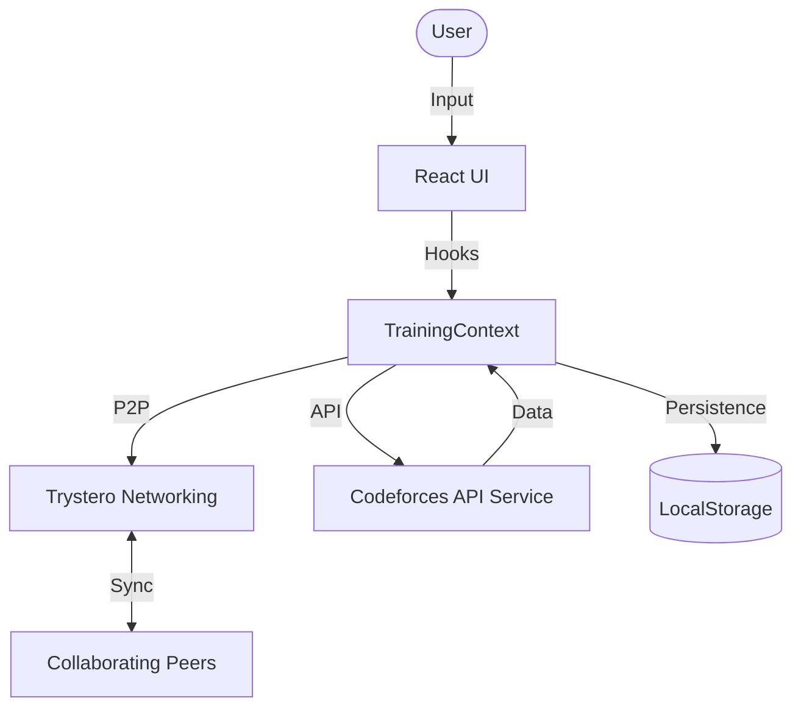

# 🚀 Codeforces Visualizer Pro

Codeforces Visualizer Pro is a high-performance, real-time analytics and training platform for competitive programmers. It transforms raw Codeforces data into actionable insights, structured training, and collaborative practice environments.

---

## 👁️ Vision

Our goal is to create a complete training ecosystem where users can:
- **Analyze** performance with interactive, depth-first analytics.
- **Identify** algorithmic blind spots via AI-powered topic analysis.
- **Practice** with personalized, growth-oriented recommendation engines.
- **Collaborate** in real-time P2P contest rooms with friends.
- **Gamify** the learning journey with streaks, badges, and XP.

---

## ✨ Core Features

### 📊 Advanced Analytics
- **Dynamic Profiles:** Real-time stats, rank zones, and submission distribution.
- **Rating Progression:** Animated charts with context-aware performance highlights.
- **Submission Heatmap:** GitHub-style activity tracker and streak monitor.
- **Tag Radar & Difficulty Distribution:** Holistic view of your algorithmic expertise.

### 🧠 Intelligent Training
- **Upsolving Assistant:** Automated detection of unsolved contest problems.
- **Growth Zone Recommendations:** Problem suggestions tailored to your current rating.
- **Virtual Mashup Generator:** Create custom contests with specific difficulty ranges.
- **Difficulty Path:** Progressive problem ladders for structured skill building.

### 👥 Collaborative Practice (P2P)
- **Custom Contest Rooms:** Create private rooms for timed practice.
- **P2P Synchronization:** Real-time leaderboard, chat, and status updates using Trystero (no backend required).
- **Practice Battles:** Timed 1v1 duels with live tracking.

### 🎮 Gamification & AI
- **Badge System:** Unlock achievements like "Graph Master" or "7-Day Streak".
- **AI Practice Coach:** Personalized daily training plans and performance analysis.
- **AI Editorial Explainer:** Simplified walkthroughs for complex problems.
- **Rating Predictor:** Forecasting future performance based on current trends.

---

## 🏗️ Architecture

Codeforces Visualizer Pro is a modern React SPA designed for speed and reliability.

### 🔄 Data Flow


### 📂 Project Structure
- **`/src/pages`**: Main application views (Dashboard, Home, ContestRooms).
- **`/src/components/features`**: Core logic for trackers, analyzers, and simulators.
- **`/src/context`**: `TrainingContext.tsx` handles global state and persistence.
- **`/src/hooks`**: `useRealtimeRoom.ts` abstracts the P2P networking logic.
- **`/src/lib/api.ts`**: Centralized API client for Codeforces integration.

### 📡 P2P Logic (Trystero)
The platform uses **Trystero (BitTorrent)** for real-time collaboration.
- **Discovery**: Peers connect using unique Room IDs passed in the URL.
- **State Sync**: Hosts broadcast room configurations and problem sets; guests request state upon entry.
- **Live Leaderboard**: Solves are broadcasted instantly to keep all participants in sync.

---

## 💻 Getting Started

### Prerequisites
- Node.js (v18+)
- npm or yarn

### Installation
1. Clone the repository:
   ```bash
   git clone https://github.com/your-repo/cf-visualizer.git
   ```
2. Install dependencies:
   ```bash
   npm install
   ```
3. Start the development server:
   ```bash
   npm run dev
   ```

### Deployment
The project is configured for easy deployment on **Vercel** or other SPA hosting providers.
```bash
npm run build
```

---

## 🤝 Contributing

We welcome contributions! To add a new feature:

1. **Components**: Place new features in `src/components/features`.
2. **State**: If global state is needed, update `TrainingContext.tsx`.
3. **Styling**: Use the existing design system in `index.css` (Glassmorphism + CF Branding).
4. **Testing**: Ensure the build passes before submitting a PR.
   ```bash
   npm run build
   ```

---

*Built with passion to elevate the competitive programming experience.*
