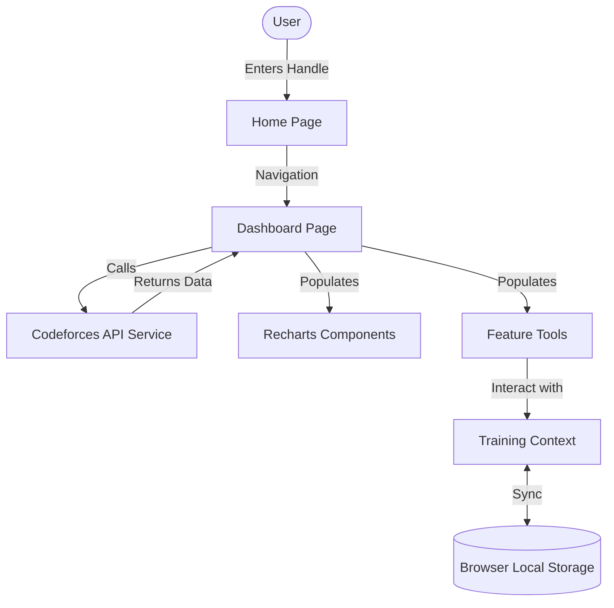

# Codeforces Visualizer Pro

Codeforces Visualizer Pro is a modern full-stack analytics and training platform for competitive programmers. It transforms raw Codeforces data into actionable insights, structured training, and collaborative practice environments.

Unlike traditional tools that only show statistics, this platform focuses on performance analytics, gamified learning, and collaborative contest simulation.

---

## 👁️ Vision

The goal of this platform is to create a complete competitive programming training ecosystem where users can:
- **Analyze** their Codeforces performance in depth.
- **Identify** algorithmic weaknesses and blind spots.
- **Practice** with personalized, growth-oriented recommendations.
- **Compete** with friends in simulated environments.
- **Track** daily progress with consistency metrics similar to fitness trackers.
- **Improve** consistently through a gamified learning journey.

---

## ✨ Core Features

### 📊 Dynamic User Profiles
Search for any Codeforces handle to view detailed statistics fetched dynamically from the official API:
- **Real-time Stats:** Current rating, Max rating, and Rank.
- **Visual Breakdown:** Submission history, contest participation, and solved problem distribution.

### 📈 Rating Progression Analytics
Interactive charts provide detailed insights into your competitive journey:
- **Animated Graphs:** Smooth visual representation of rating over time.
- **Rank Zones:** Backgrounds color-coded by Codeforces rating bands.
- **Insightful Context:** Hover-based contest details and performance highlights.

**Rating Band Reference:**
| Rating | Rank |
| :--- | :--- |
| < 1200 | Newbie |
| 1200–1399 | Pupil |
| 1400–1599 | Specialist |
| 1600–1899 | Expert |
| 1900–2099 | Candidate Master |
| 2100+ | Master |

### 🗓️ Submission Activity Heatmap
A GitHub-style calendar heatmap to visualize daily coding activity, tracking practice consistency, and longest streaks.

### 📊 Performance Charts
- **Problem Difficulty Distribution:** Understand your comfort zone with a breakdown of solved problems by rating.
- **Tag Performance Radar:** Quick identification of strengths and weaknesses across algorithmic topics (DP, Graphs, Math, etc.).

---

## 🛠️ Advanced Training Tools

### 🆘 Upsolving Assistant
Automatically detects problems from past contests that you attempted but didn't solve, encouraging effective post-contest learning.

### 🧠 Practice Recommendation Engine
Analyzes your solved history to suggest problems in your **Growth Zone**: `Current Rating ± 200`.

### 🎲 Virtual Mashup Generator
Generate custom practice contests by specifying number of problems, difficulty ranges, and division simulation.

### 📝 Training Context System
- **Bookmarks:** Save problems to revisit.
- **Practice Queue:** Organize your daily workflow.
- **Personal Notes:** Attach hints or strategies to specific problems (stored locally).

---

## 🏗️ Architecture Overview

Built as a high-performance React Single Page Application.

### 🔄 Data Flow

### 📂 Core Structure
- **API Tier (`src/lib/api.ts`):** Robust abstraction over the official CF API.
- **State (`src/context/`):** Persistent training context using custom hooks.
- **UI Components:** Modular library divided into `charts`, `features`, `tools`, and `ui`.

---

## 🗺️ Future Roadmap

We are constantly evolving the platform. Here are the features currently in development:

### 👥 Collaborative Features
- **Custom Contest Rooms:** Private rooms with live leaderboards and real-time tracking.
- **1v1 Practice Battles:** Challenge friends to timed coding duels.

### 🎮 Gamified Learning
- **XP & Points System:** Earn experience for solving problems and completing daily goals.
- **Achievement Badges:** Unlock honors like 🔥 7-Day Streak or 🧠 Graph Master.

### 🤖 AI-Powered Features
- **Weak Topic Analyzer:** automated detection of algorithmic blind spots.
- **AI Practice Coach:** Personalized daily training plans.
- **Rating Predictor:** Future rating forecasting based on accuracy and consistency.
- **AI Editorial Explainer:** Simplified explanations of complex problem strategies.

---

## 💻 Tech Stack

- **Core:** React 18, Vite, TypeScript
- **Styling:** Tailwind CSS (Vibrant Dark Mode)
- **Visualization:** Recharts, Framer Motion
- **Services:** Codeforces API, LocalStorage API

---

*Built by the Google DeepMind Antigravity Team to elevate the competitive programming experience.*
